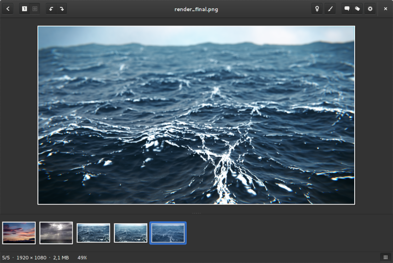

# Adwaita Neutral

This is an alternative version of the Adwaita GTK theme (default in Gnome
Shell). The dark vesion has fully neutral grey colors, instead of the green hues in
the original.

The main reason for making this was using the dark theme with gThumb and MyPaint
(and maybe Inkscape and GIMP in the future too!). The green hues of the original
can affect the way you percieve hues in the image/video you're working on. For
design work it's advisable to use neutral greys in the UI. 

(It also looks way cooler)

Read more about color theory: [on
Wikipedia](http://en.wikipedia.org/wiki/Color_vision#Subjectivity_of_color_perception)

The light version is not changed. Based on 3.16.

## Screens

